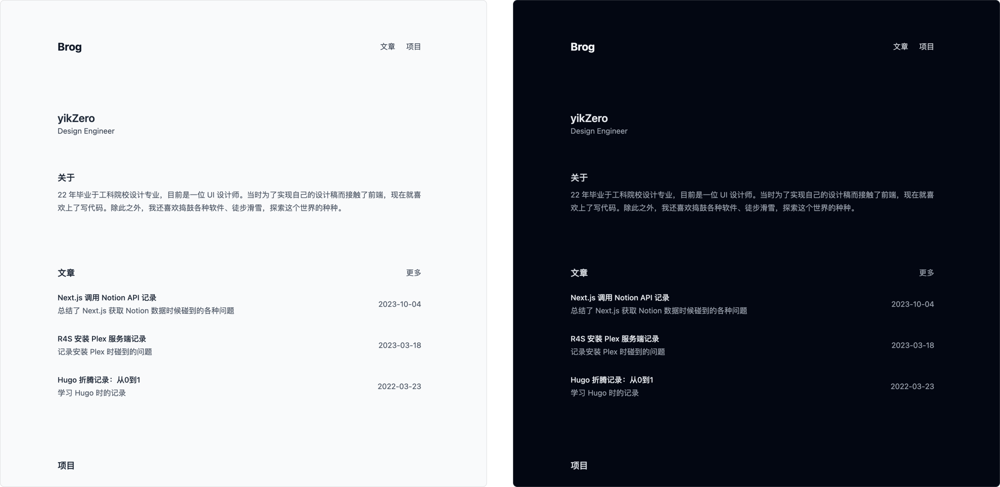

<h4 align="right"><strong>English</strong> | <a href="https://github.com/yikZero/Brog/blob/content-mdx/README_CN.md">简体中文</a></h4>
<h1 align="center">Brog</h1>

<p align="center"><strong>Next.js Blog powered by Sanity or MDX</strong></p>

<div align="center">
    <a href="https://twitter.com/yikZero" target="_blank">
    </a>
    <a href="https://github.com/yikZero/Brog/blob/content-mdx/LICENSE" target="_blank">
    </a>
</div>

## Preview



## Features

- 🌓 Adaptive Light/Dark Theme
- 📏 Minimalist Design
- ⚡ Ultra-Fast Response Time
- 📡 Customizable RSS Feed Integration
- 🌐 SEO-Optimized
- 🗺️ Sitemap Configuration

## Tech Stack

- [Next.js](https://nextjs.org/)
- [React](https://react.dev/)
- [TypeScript](https://www.typescriptlang.org/)
- [Tailwind CSS](https://tailwindcss.com/)
- [Vercel](https://vercel.com/)
- [MDX](https://mdxjs.com/)

## Deploy


[](https://vercel.com/new/clone?repository-url=https%3A%2F%2Fgithub.com%2FyikZero%2FBrog&env=NEXT_PUBLIC_SANITY_PROJECT_ID,NEXT_PUBLIC_SANITY_DATASET&envDescription=%E8%BF%9E%E6%8E%A5%20Sanity%20%E6%95%B0%E6%8D%AE%E5%BA%93%E6%89%80%E9%9C%80%E5%86%85%E5%AE%B9&envLink=https%3A%2F%2Fwww.sanity.io%2Fguides%2Fnextjs-app-router-live-preview&project-name=brog&repository-name=Brog&demo-title=Brog%20Demo&demo-description=A%20ISR%20Blog%20using%20Next.js%20and%20Sanity&demo-url=https%3A%2F%2Fblog.yikzero.com%2F)

#### Environment Variables

| Field Name               | Example Value                                      | Description                            |
|--------------------------|-----------------------------------------------------|----------------------------------------|
| WEB_TITLE                | Brog                                              | Website Title                          |
| WEB_DESCRIPTION          | It's my blog of all...                            | Website description                      |
| BLOG_TITLE               | Brog                                              | Menu Bar Title                         |
| AUTHOR                   | yikZero                                           | Author Name                            |
| OCCUPATION               | Design Engineer                                   | Occupation                             |
| BIO                      | I‘m a boy                                         | Author Bio                             |
| CONTACT_EMAIL            | i@yikzero.com                                     | Email Address, used for Gravatar       |
| SITE_URL                 | https://blog.yikzero.com                           | Site url, Generate SiteMap             |
| HOMEPAGE_POST_NUMBER     | 3                                                   | Number of Posts Displayed on Homepage  |
| HOMEPAGE_PROJECT_NUMBER  | 3                                                   | Number of Projects Displayed on Homepage |
| SINCE                    | 2023                                                | If empty, the current year is used     |

## Local Environment Setup

```bash
pnpm install
pnpm run dev
```